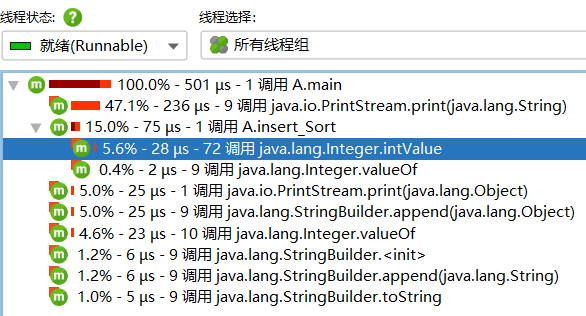

# 探究插入排序操作耗时
## 使用工具
   软件：IDEA;
   插件：jprofiler
## 步骤一：下载Jprofiler [下载链接](https://plugins.jetbrains.com/plugin/253-jprofiler)
    > 1在IDEA中下载JProfiler插件，具体步骤：点击右上角File->settings->plugi,搜索插件Jrofiler安装。安装插件后才能与Jrofiler集成
    > 2.下载Jrofiler。插件安装成功后，重启IntelliJ，可以看到已经有jprofiler 工具图标,点击图标后，发现需要指定可执行的程序。windows上指向 bin\jprofiler.exe 文件即可。


## 步骤二：插入排序代码
   ```javascript
   public class A {
    public static void insert_Sort(Integer[] a)
    {
        if(a==null||a.length==0)
        {
            return;
        }
        int i,j,temp;
        for(i=1;i<a.length;i++)
        {
            if(a[i-1]>a[i])
            {
                temp=a[i];
                for(j=i-1;j>=0&&a[j]>temp;j--)
                {
                    a[j+1]=a[j];
                }
                a[j+1]=temp;
            }
        }
    }
    public static void main(String[] args) {
        Integer[] a={10,9,8,7,6,5,4,3,2,1};
        insert_Sort(a);
        for(int i=0;i<a.length;i++)
        {
            if(i==a.length-1)
            {
                System.out.print(a[i]);
            }
            else
                System.out.print(a[i]+",");
        }
    }
}
```

## 分析结果
Jprofile运行CPU视图如下：

   
   
由CPU调用树的的运行截图来看，在插入排序中负责对数组插入排序的insert_Sort方法在所有线程中占用比例最大，也就说明其运行的时间最久。
    
通过热点图可清晰的见到classA中insert_Sort所用时间，进一步证明其为插入排序最耗时的部分。


